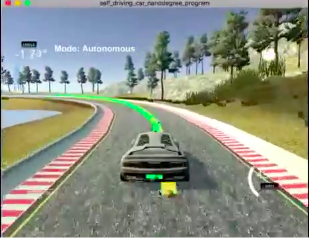

# Model Predictive Control
This project involves two things. Fisrt, we build a mathematical model of how the car behaves. Then, the program makes actuator decisions (throttle and steering) to make sure it drives along a stable path in a non-alcoholic way!

## How to run the project
Check dependencies and instructions here: [MPC Project](https://github.com/udacity/CarND-MPC-Project). I use the same folder organization so you can follow the instructions as they are.

### The Model State
First, here are the basic quantities we use to describe our car's movement. I think these are very intuitive, although we can go as much further as we want (adding the vehicle geometry, friction of tyres and what not):
1. The car's position (x and y coordinates)
2. The car's speed (v)
3. The angle/orientation of the car (psi)

Now, we also have a calculated reference trajectory which we want our car to follow. This trajectory is a list of x,y coordinates. We turn these "waypoints" into a real trajectory by choosing a 3-degree polynomial that fits this set of coordinates. Once we have a trajectory, we now have two more quantities we can add to our car's model:
1. The cross-track error, cte (how far the car is from where it's supposed to be)
2. The error in orientation, epsi (how much the car is wrongly rotated compared to how it should be)

Finally, we have the acceleration (a) and the steering angle (delta) which will be tweaked by our program to make sure that it follows the reference path!

### Model Equations
These equations describe how different quantities of the model relate to each other. This is basic high-school physics, so it's nothing fancy. However, the more advanced we make our model, the more complicated our equations can become.
1. **future_position = current_position + (speed x time_difference)**
_xf = xp + v*cos(psi)*dt_, and _yf = yp + v*sin(psi)*dt_

2. **future_speed = current_speed + (acceleration * time_difference)**
_vf = vp + a*dt_

3. **future_angle = current_angle - (speed * steering * time_difference / vehicle_geometry_constant)**
_psi_f = psi_p - (v * delta * dt / Lf)_

4. **future_cte = current_cte + change in position**

5. **future_epsi = current_epsi + change in orientation**

### Timestep Length, Elapsed Duration and System Latency
So we have a trajectory, but we need to now choose actuations such that our car follows the trajectory. A question arises:
**For how long do you need to follow the trajectory? The situation on the road changes every few seconds, and with it the particular trajectory you have now will also change.**

There can be a lot of experimentation in this regard, but it's best to only approximate the trajectory for less than 3-4 seconds. Beyond that, the unpredictability rises too much and the car may react to slowly to changes in the environment - for example, not decelerating fast enough at a curve in the road. This can be very dangerous.

Moreover, there is also an inherent latency inside a car's systems. There's a time delay of a few milliseconds between when the throttle/steering input is decided and when the car actually makes that turn/acceleration. We also need to model this into our equations.

After some experimentation, I chose the timestep dt to be 0.15 seconds. However, because of the latency, we need to actuate the vehicle based for a future state (after 100ms), not the present state. Therefore, I send the *second* actuator values for steering and throttle to the simulator, and not the present calculated values. This makes sure that after the vehicle has travelled during the 100ms, it will receive appropriate actuator values.

### Polynomial fitting
(See main.cpp code)
Since the waypoints are chosen in the global coordinate system of our map, they are not very useful for the car unless they are in the car's own coordinate system (i.e a system in which the car is centered at the origin). So we make that conversion.

## License
[GNU General Public License](http://choosealicense.com/licenses/gpl-3.0/#)
_Just don't be a douche and don't plagiarize. Thanks! :)_

